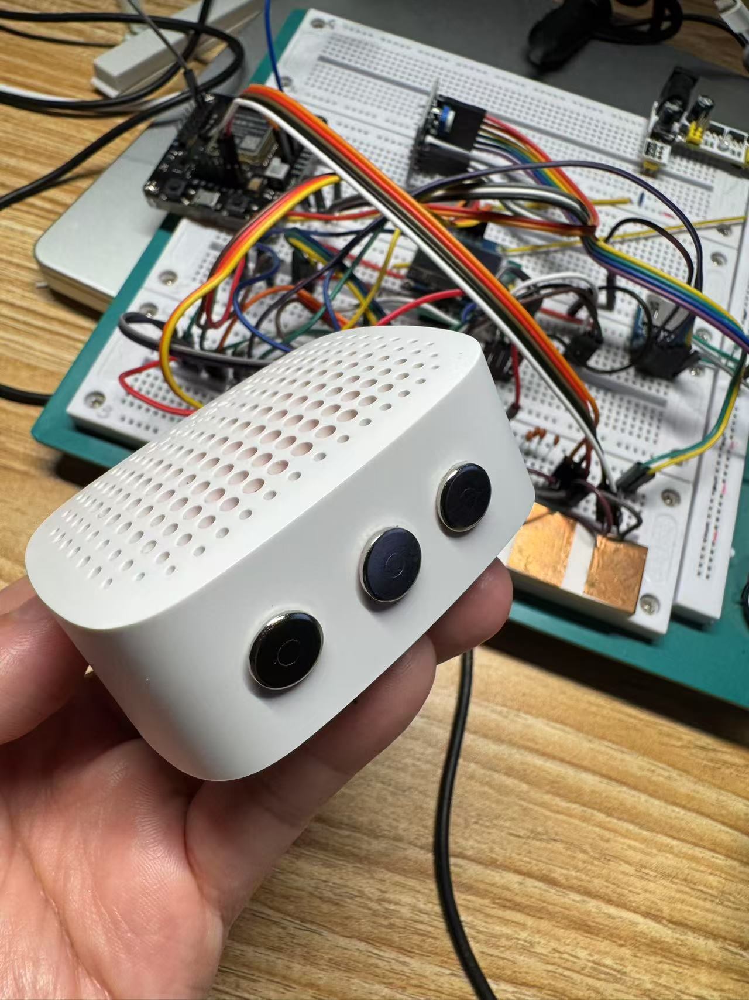
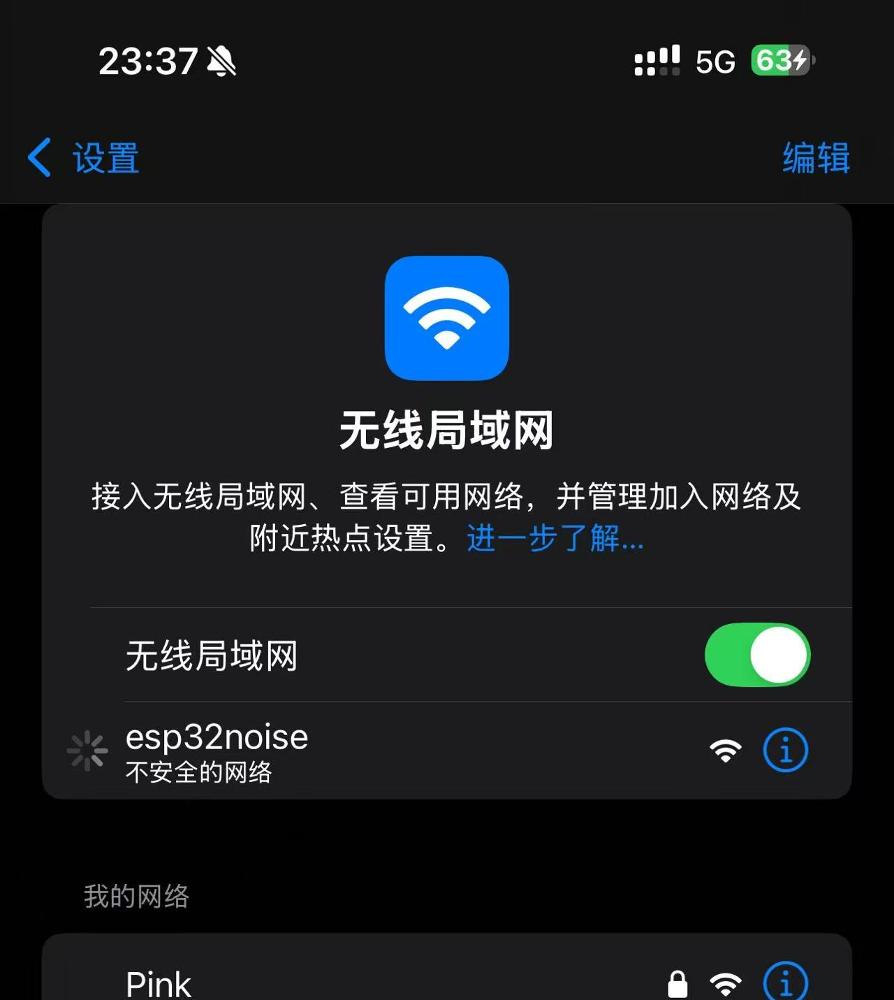
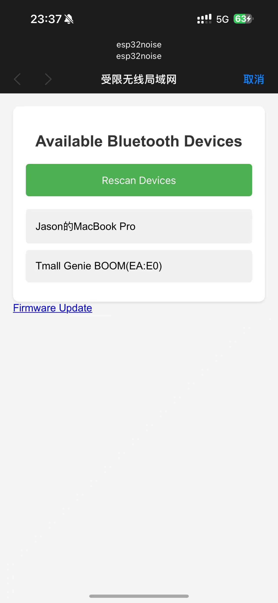
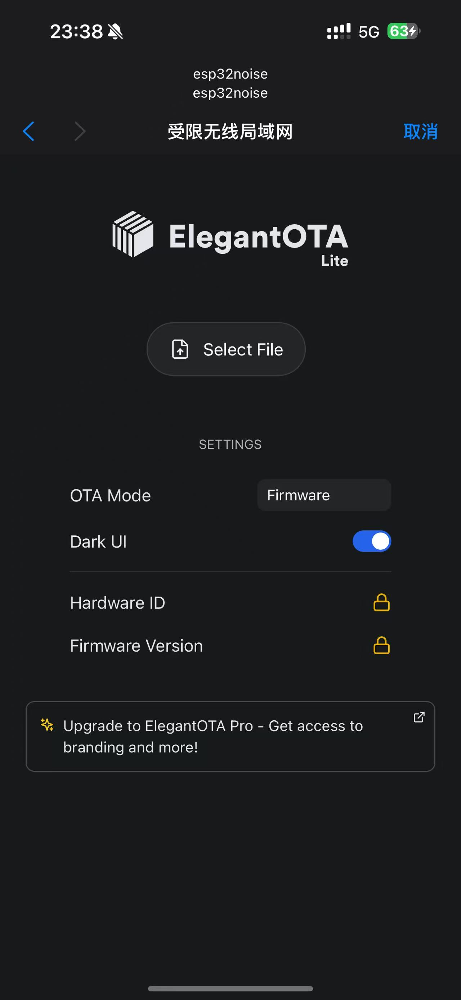
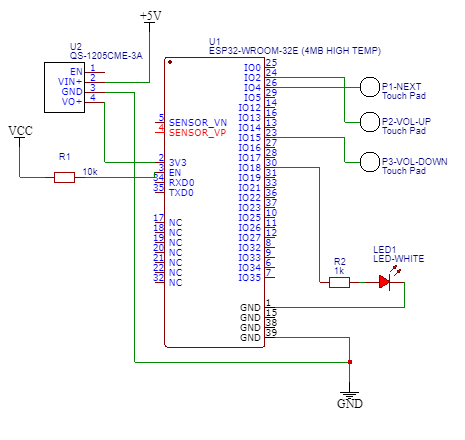
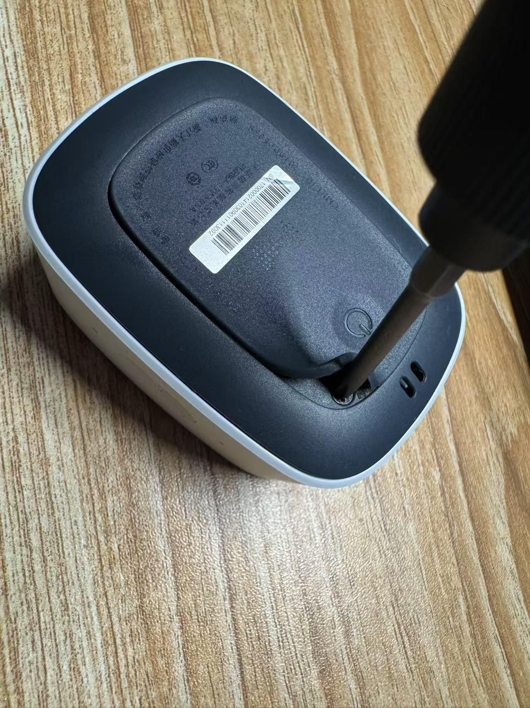
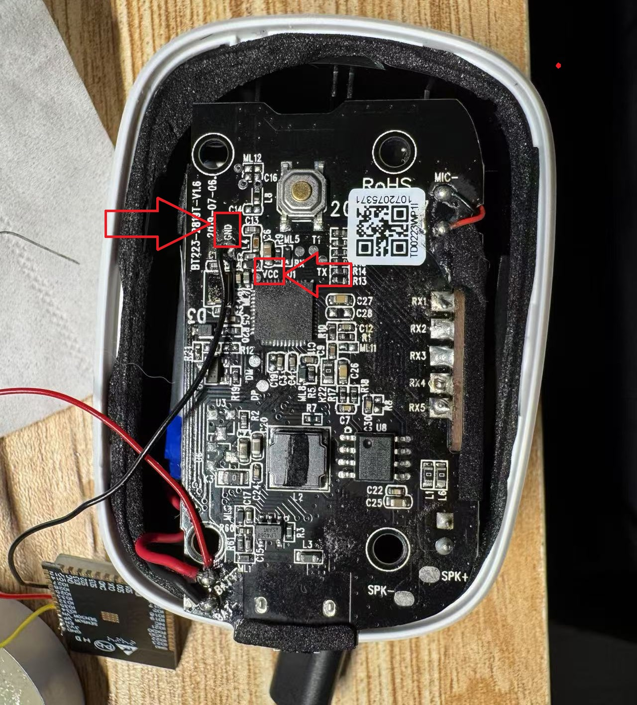
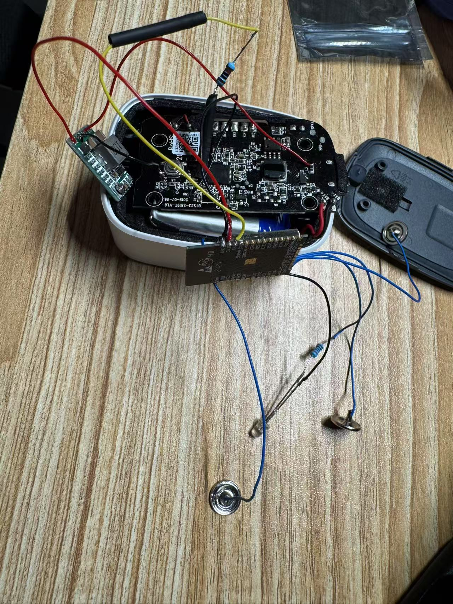

# Bluetooth A2DP Pink Noise player/transmitter using ESP32

## Introduction
This software makes your ESP32 board act as a Bluetooth A2DP player/transmitter and plays pink noise via your Bluetooth speaker.

This project is for ESP32 boards only - other ESP32s doesn't support A2DP. 

## Features
Configure your Bluetooth speaker via WiFi AP and web interface.

3 capacitive touch buttons are used to control the player:
* Volume Up
* Volume Down
* Mute

Combo buttons:
* VolUp + VolDown = Next noise: brown noise -> pink noise -> loud white noise
* VolUp + VolDown + Mute = enable WiFi AP and web interface. 
 
The LED will be blinking for 15 seconds to load bluetooth device list, and then a WiFi AP 'ESP32PinkNoise' will be created. A captive portal will be shown on your phone or computer when you connect to this WiFi AP. Then you can select your Bluetooth speaker or upgrade the firmware via this web interface.

## build environment

* Arduino IDE
* Espressif esp32 SDK v3.0.7 - currently ESPAsyncWebServer has a bug with the latest version of ESP32 SDK
* ESP32-A2DP
* ESPAsyncWebServer

Not required to be installed:
* ElegantOTA is included in the project because it needs to set ELEGANTOTA_USE_ASYNC_WEBSERVER = 1 in order to work with ESPAsyncWebServer.

## Flash the firmware
Please use the following settings to flash the firmware:
* CPU Frequency: 160 MHz to save power.
* Partition Scheme: Minimal SPIFFS (1.9MB APP with OTA/190KB SPIFFS)
The firmware size is over 1.8 MB so that it is important to select the correct partition scheme.

## Select your Bluetooth speaker
WiFi can't be connected while Bluetooth is working on ESP32 due to ESP23 hardware restriction. The ESP32 WiFi/BT co-existing mode is unstable. So it has to scan BT device when WiFi is off and turn off BT before enabling WiFi.

1. Turn on your Bluetooth speaker and make sure it is in pairing mode.
2. press all three buttons at same time and you will see the LED blinking for up to 15 seconds.
3. Then the LED will be always on. Connect to the WiFi AP 'esp32noise' and your device should pop up the captive portal. If not, please try to open any web page in your browser and it should be redirected to the captive portal.

4. Select your Bluetooth speaker from the list.

5. The device will turn off the WiFi AP and try to connect to your Bluetooth speaker.
6. If the connection is failed, please press all three buttons at same time to turn on the WiFi AP and try again.

Alternatively, you may set defaultBtName to your Bluetooth speaker's name in the code 'config.h'.

## OTA upgrade

1. press all three buttons at same time and you will see the LED blinking for up to 15 seconds.
2. Then the LED will be always on. Connect to the WiFi AP 'esp32noise' and your device should pop up the captive portal. If not, please try to open any web page in your browser and it should be redirected to the captive portal.
3. Compile the project by clicking Sketch -> Export compiled binary to compile the project. The compiled binary will be saved to the folder 'build\esp32.esp32.esp32da' in the project folder.
4. Select 'Update Firmware' to upgrade the firmware file 'esp32_pink_noise.ino.bin'.

5. Wait for the firmware to be upgraded
6. The device will be rebooted after the firmware is upgraded.

## Schematic

## Tmall Genie BT Speaker Modification 
Open the speaker by removing the screws.

You may find Vcc and GND on the PCB board.

Solder the wires to ESP32, DCDC and the buttons.

ESP32 and DCDC boards are so tiny that can be inserted into the speaker.

## Tips
The capacitive touch buttons can be any metal material such as pin, nail, paper clip, etc.
You may need to polish the oxydic surface before soldering the wires to the buttons.

The ESP32 board can be mounted on the back of or inside the speaker.
